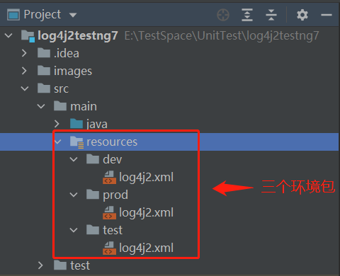
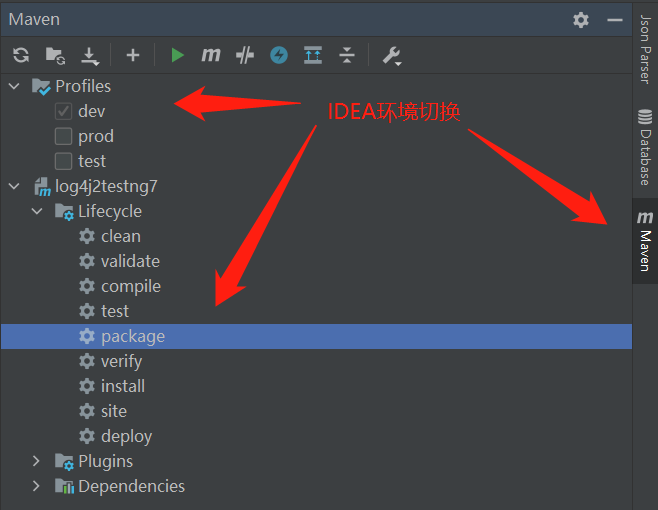

# log4j2testng7
## 所用技术
maven 3.6.3  
Log4j  2.13.3  
TestNG  7.1.0


单元测试时继续下面这个类是带事务管理的  
AbstractTransactionalTestNGSpringContextTests  

下面这个不带事务管理的  
AbstractTestNGSpringContextTests  

## testng7.5 需要JDK1.8以上
## testng7.6 需要JDK11以上

### 环境切换方式如下:

#### 1: 在项目的 pom.xml 中添加 profiles 和 build 属性

```
	<build>
		<!-- 工程 打包名 -->
		<finalName>${project.artifactId}-${profiles.active}</finalName>
		<!-- main 源码路径 -->
		<sourceDirectory>src/main/java</sourceDirectory>
		<!-- test 源码路径 -->
		<testSourceDirectory>src/test/java</testSourceDirectory>
		<!-- 需要 打包的 资源 -->
		<resources>
			<resource>
				<!-- 项目的默认资源目录 但是要排除不必要的文件 -->
				<directory>${project.basedir}/src/main/resources</directory>
				<!-- 排除 -->
				<excludes>
					<exclude>test/*</exclude>
					<exclude>dev/*</exclude>
					<exclude>prod/*</exclude>
				</excludes>
			</resource>
			<!-- 想要指定加入的 再下面的 resource 指定  -->
			<resource>
				<!-- 这里会直接把 ${profiles.active} 对应文件夹下的内容打包到 classpath 下 -->
				<directory>${project.basedir}/src/main/resources/${profiles.active}</directory>
				<!-- 包含 -->
				<includes>
					<include>**/*.xml</include>
				</includes>
				<!-- 是否 替换 资源中的 属性 -->
				<filtering>true</filtering>
			</resource>
		</resources>
	</build>
	
	<!-- 环境切换 -->
	<profiles>
		<profile>
			<id>dev</id>
			<properties>
				<!-- 环境标识 需要与配置文件的名称相对应 -->
				<profiles.active>dev</profiles.active>
			</properties>
			<activation>
				<!-- 默认环境 -->
				<activeByDefault>true</activeByDefault>
			</activation>
		</profile>
		<profile>
			<id>test</id>
			<properties>
				<profiles.active>test</profiles.active>
			</properties>
		</profile>
		<profile>
			<id>prod</id>
			<properties>
				<profiles.active>prod</profiles.active>
			</properties>
		</profile>
	</profiles>
```

#### 2: 在 resources 下分别创建 dev test prod 包



#### 3: 环境切换

##### IDEA环境切换/打包



##### MVN指令切换/打包

```
mvn package -Ptest
mvn package -Pdev
mvn package -Pprod

推荐
mvn clean package -Ptest
mvn clean package -Pdev
mvn clean package -Pprod
```

#####  BUILD SUCCESS

