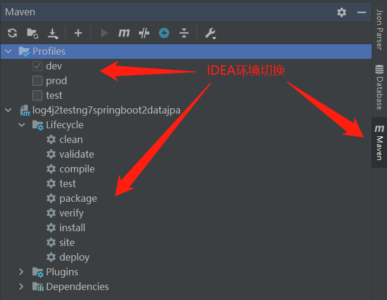

# log4j2testng7springboot2datajpa

## 一 所用技术  

maven  3.6.3  
SpringBoot  2.4.4  
SpringDataJpa  
Log4j  
TestNG  7.1.0

## 二 数据库连接  
10.0.193.11  
3306  
root  
root

## 三 编程思路
面向业务编程  

单元测试时继续下面这个类是带事务管理的  
AbstractTransactionalTestNGSpringContextTests  

下面这个不带事务管理的  
AbstractTestNGSpringContextTests  

## 四 环境切换方式 如下:

#### 1: 在项目的 pom.xml 中添加 profiles 属性

```
	<build>
		<!-- 工程 打包名 -->
		<finalName>${project.artifactId}-${profiles.active}</finalName>
	</build>
	<!-- 环境切换 -->
	<profiles>
		<profile>
			<id>dev</id>
			<properties>
				<!-- 环境标识 需要与配置文件的名称相对应 -->
				<profiles.active>dev</profiles.active>
			</properties>
			<activation>
				<!-- 默认环境 -->
				<activeByDefault>true</activeByDefault>
			</activation>
		</profile>
		<profile>
			<id>test</id>
			<properties>
				<profiles.active>test</profiles.active>
			</properties>
		</profile>
		<profile>
			<id>prod</id>
			<properties>
				<profiles.active>prod</profiles.active>
			</properties>
		</profile>
	</profiles>
```

#### 2: 在 resources 的 application.yml 添加配置内容

```
spring:
  profiles:
    active: @profiles.active@
```

#### 3: 环境切换

##### IDEA环境切换/打包



##### MVN指令切换/打包

```
mvn package -Ptest
mvn package -Pdev
mvn package -Pprod

推荐
mvn clean package -PXXX环境
```

#####  BUILD SUCCESS

## 五 undertow 容器配置 如下:

#### .yml 配置详解

```
server:
  port: 8181 #端口号
  servlet:
    encoding:
      charset: UTF-8
      enabled: true
      force: true
  # undertow 容器配置
  undertow:
    # HTTP post 内容的最大长度 当值为 -1 时 默认值为大小是无限的
    max-http-post-size: -1
    # 以下的配置 会影响 buffer 这些 buffer 会用于 服务器连接的 IO 操作 有点类似 netty 的池化内存管理
    # 每块 buffer 的空间大小 越小的空间 被利用越充分 不要设置太大 以免影响其他应用 合适即可
    buffer-size: 512
    # 是否 分配的 直接内存( NIO 直接分配的堆外内存)
    direct-buffers: true
    # 日志配置
    accesslog:
      # 开启 accesslog
      enabled: true
      # 日志路径
      dir: /logs/access_log_@artifactId@
      # 前缀
      prefix: accesslog
      # 后缀
      suffix: .log
      # 是否另起日志文件写 access log 默认为 true
      # 目前只能按照 日期进行 rotate 一天一个日志文件
      rotate: true
      # 日志格式
      # %a 远程 IP 地址
      # %A 本地 IP 地址
      # %h 远程主机名(或者 IP 地址 如果连接器的 enableLookups 为 false)
      # %H 请求协议
      # %m 请求方法
      # %U 请求的 URL 路径
      # %l 远程逻辑用户名从 idd (总是返回 '-')
      # %p 本地端口
      # %q 查询字符串（不包括 ？字符）
      # %u 通过身份验证的远程用户
      # %t 日期和时间 常用日志格式
      # %r 请求的第一行
      # %s 响应的 HTTP 状态码
      # %S 用户会话 ID
      # %b 发送的字节 不包括 HTTP 头 如果没有发送字节 则使用 '-' 发送的字节 不包括HTTP头 如果没有发送字节 则使用 '-'
      # %B 发送的字节 不包括 HTTP 标头
      # %v 本地服务器名称
      # %D 处理请求所需的时间 单位为毫秒
      # %T 处理请求所花费的时间 以秒为单位
      # %I 当前请求线程名(稍后可以与 stacktrace 进行比较) 执行当前请求的线程名称 输出可以统计多少线程在工作 当然也可以通过其他方式 jstack
      # %{i,你要看的 header 值} 查看 header 的某个 key 的值 逗号后面注意不要有空格 因为这个空格会算入 key 里面导致拿不到你想要的 key
      # %{o,xxx} 用于传出响应标头
      # %{c,xxx} 对于特定的 Cookie
      # %{r,xxx} xxx 是 ServletRequest 中的属性
      # %{s,xxx} xxx 是 HttpSession 中的属性
      pattern: '{
                  "transportProtocol":"%{TRANSPORT_PROTOCOL}",
                  "scheme":"%{SCHEME}",
                  "protocol":"%{PROTOCOL}",
                  "method":"%{METHOD}",
                  "reqHeaderUserAgent":"%{i,User-Agent}",
                  "cookieUserId":"%{c,userId}",
                  "queryTest":"%{q,test}",
                  "queryString":"%q",
                  "relativePath":"%R, %{REQUEST_PATH}, %{RESOLVED_PATH}",
                  "requestLine":"%r",
                  "uri":"%U",
                  "thread":"%I",
                  "hostPort":"%{HOST_AND_PORT}",
                  "localIp":"%A",
                  "localPort":"%p",
                  "localServerName":"%v",
                  "remoteIp":"%a",
                  "remoteHost":"%h",
                  "bytesSent":"%b",
                  "time":"%{time,yyyy-MM-dd HH:mm:ss.S}",
                  "status":"%s",
                  "reason":"%{RESPONSE_REASON_PHRASE}",
                  "requestUserAgent":"%{i,User-Agent}",
                  "respHeaderUserSession":"%{o,userSession}",
                  "respHeaderContentLength":"%{o,content-length}",
                  "respCookieUserId":"%{resp-cookie,userId}",
                  "timeUsed":"%Dms, %Ts, %{RESPONSE_TIME}ms, %{RESPONSE_TIME_MICROS} us, %{RESPONSE_TIME_NANOS} ns"
                }'
  shutdown: graceful #开启优雅停机 默认为immediate立即停机

```

