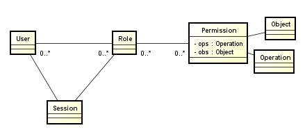
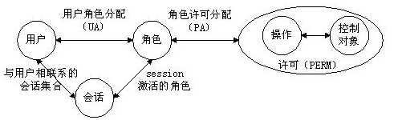

# RBAC0
## RBAC0的模型中包括用户（U）、角色（R）和许可权（P）等3类实体集合。
## RABC0权限管理的核心部分，其他的版本都是建立在0的基础上的

### RBAC(Role Based Access Control)基于角色的访问控制
### RBAC0是RBAC的核心，主要有四部分组成：
#### 1、用户（User）
#### 2、角色（Role）
#### 3、许可（Permission）
#### 4、会话（Session）

  
  

RBAC Model  
基于角色的访问控制模型  

core concept: user,role,permission,operation,resource  
核心概念:用户，角色，许可，操作，资源  

user has many roles, assign role to user; one role can be assigned to many users.  
用户拥有多个角色，分配角色给用户；一个角色可以分配给多个用户。  

user has many permissions, assign permission to user; one permission can be assigned to many users.  
用户拥有多种许可，分配许可给用户；一个许可可以分配给多个用户。  

role has many permissions, a role is a package of permissions.  
角色拥有多种许可，一个角色是多个许可的一种包装。  

operation is like add, update, delete, import, download, visible, invisible, etc.  
操作是像添加，修改，删除，导入，下载，可见，不可见，等等操作。

resource is like menu, button, or other screen elements.  
资源是像菜单，按钮，或其他屏幕元素。  

permission has many resources and operations; one resource can be used by many permissions; one operation can be used by many permissions.  
许可=资源+操作；一种资源可以被用于多种许可；一个操作可以被用于多种许可；
